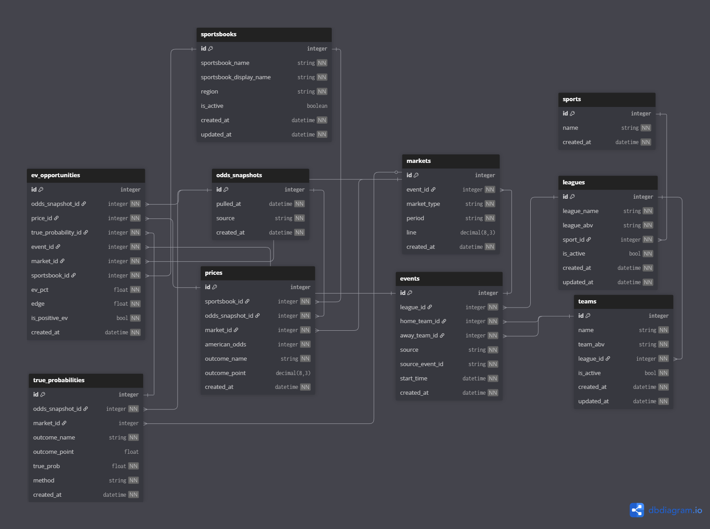

# DB Schema
Up-to-date as of Release 0.6.0

# Model Purposes
1. **sports.py | leagues.py | teams.py | sportsbooks.py**
    * These schemas will rarely change are primarily seeding tables to support functionality of the rest of the dynamic tables
    * They only store meta information about their respective topics (no stats/no odds)

2. **markets.py**
    * It contains all lines for a specific event and specific market type. This can change as the week goes on.
    * However, it doesn't hold a "line" attribute for the moneyline, only for markets where there is an over/under line.
    * Many sportsbooks can point to the same market_id which helps minimize number of entries in the case where many sportsbooks are having the same line

3. **events.py**
    * This table keeps up to date on upcoming events and only keep metadata related to the event itself (no odds/stats relations)
    * One per game

4. **odds_snapshot.py**
    * On every pull of odds, a new entry is added here so we can keep track of how the odds change from one snapshot to another
    * One per ingest_odds run

5. **prices.py**
    * Entries in the prices.py table contain all pertinent data regarding prices of a specific market at a specific snapshot before the start of the match
    * It allows us to see how the odds for certain outcomes/markets change throughout the week
    * One per market/sportsbook/snapshot/outcome_name

6. **true_probabilities.py**
    * This table contains true probabilities for each event outcome per market across different snapshots.
    * It allows us to see how true probabilities computed from the set of sportsbooks change throughout the week 
    * One per market/snapshot/outcome_name

7. **ev_opportunity.py**
    * This table contains the expected value opportunities that are positive over the long term
    * One per price assuming it is positive using the related true probability for that market/outcome